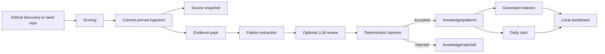

# GitHub Pattern Knowledge

[](https://github.com/libenxier-beep/github-pattern-knowledge/actions/workflows/ci.yml)
[](LICENSE)
[](package.json)

A local daily learning loop for agents: discover one high-quality open source repository, extract transferable engineering patterns, and save them as traceable Markdown knowledge.

The project is built for Codex and other programming agents that need reusable engineering judgment, not another trending-repo feed. The main output is a file-backed knowledge base under `knowledge/patterns/`; the dashboard and daily cards are secondary reading surfaces.

## What It Does

- Finds or ingests GitHub repositories worth studying.
- Scores candidates by engineering quality, long-term impact, and recent activity.
- Fetches README, metadata, tree summaries, and selected source files at a concrete commit.
- Extracts 1-3 engineering pattern drafts from bounded evidence.
- Validates every draft with a deterministic harness before accepting it.
- Writes accepted patterns as Markdown notes with YAML frontmatter.
- Regenerates JSON indexes for agent retrieval.
- Produces a local dashboard and human-facing daily card.

## Why This Exists

Most agents can summarize a repository once. This project tries to make the useful part durable.

Instead of saving vague takeaways like "this repo has good architecture", it stores pattern notes that include:

- the engineering problem the pattern solves
- when to use or avoid it
- boundary decisions and tradeoffs
- failure modes and simpler alternatives
- concrete source evidence from commit-pinned files
- retrieval tags for later agent use

The goal is a growing local library of engineering patterns that an agent can reopen, audit, and apply in future software work.

## How It Works



LLM usage is intentionally narrow. Discovery, scoring, ingestion, source snapshotting, validation, indexing, learned-repo registry writes, and dashboard reads are deterministic. LLMs may only help with pattern extraction and review, and only from a bounded evidence pack.

## Tech Stack

- TypeScript and Node.js for the CLI, ingestion, scoring, validation, and file-backed pipeline.
- Vite and React for the local dashboard.
- GitHub REST API through `fetch`, with optional `GITHUB_TOKEN`.
- Markdown plus YAML frontmatter for durable notes.
- Generated JSON indexes for retrieval.
- Vitest for behavior tests.

## Quick Start

```bash
git clone https://github.com/libenxier-beep/github-pattern-knowledge.git
cd github-pattern-knowledge
npm install
cp .env.example .env.local
npm run daily -- --fixture
npm run dev
```

Open the Vite URL shown in the terminal to view the local dashboard.

The deterministic fixture run is the easiest first smoke test. For real GitHub discovery, run:

```bash
npm run daily
```

## Configuration

The tool can run without secrets, but unauthenticated GitHub API limits are lower.

```bash
export GITHUB_TOKEN=your_github_token_here
```

Optional LLM extraction:

```bash
export OPENAI_API_KEY=your_openai_api_key_here
export EXTRACTOR_MODE=auto        # auto | heuristic | llm
export OPENAI_MODEL=gpt-5.5
export OPENAI_REASONING_EFFORT=medium
export LLM_REVIEW=1
```

`EXTRACTOR_MODE=auto` uses the LLM extractor only when `OPENAI_API_KEY` is present. `EXTRACTOR_MODE=heuristic` always uses the deterministic extractor. `EXTRACTOR_MODE=llm` requires `OPENAI_API_KEY` and falls back safely if extraction fails.

Keep secrets in the shell environment or `.env.local`. Do not commit `.env`, `.env.local`, tokens, `node_modules`, `dist`, or generated private knowledge data.

## Knowledge Location

When used as a local Codex system project, the default generated knowledge root is:

```txt
$HOME/.codex/memories/work_contexts/github_engineering_patterns/
```

You can override it:

```bash
export KNOWLEDGE_ROOT=/path/to/knowledge-root
```

Expected layout:

```txt
knowledge-root/
  README.md           work-context entry and routing guidance
  patterns/           accepted pattern notes
  indexes/            generated retrieval indexes
  cards/              daily human-facing cards
  registry/           seed and learned-repo registries
  rejected/           failed drafts plus failure metadata
  sources/            commit-pinned source snapshots
  schemas/            taxonomy and retrieval strategy
  runs/               run metadata and failure records
```

`patterns/` is the source of truth. `indexes/` is generated cache.

## Commands

```bash
npm run daily                 # full daily loop
npm run daily -- --fixture    # deterministic smoke run
npm run seed -- --list        # show pending seed repos
npm run seed -- --limit 3     # process pending seed repos
npm run evidence              # backfill or tighten evidence tables
npm run index                 # regenerate retrieval indexes
npm run harness               # validate accepted pattern notes
npm run dev                   # start local dashboard
npm run typecheck             # TypeScript check
npm test                      # Vitest suite
npm run build                 # production build
```

## Daily Run

`npm run daily` performs the full loop:

1. Load pending seed repos first, then fall back to open GitHub discovery.
2. Skip repositories already recorded in `registry/learned_repos.json`.
3. Score candidates with engineering quality, long-term impact, and recent activity.
4. Select one repository.
5. Resolve a concrete commit SHA.
6. Fetch README, metadata, tree summary, and selected files at that commit.
7. Write a source snapshot.
8. Extract pattern drafts from the bounded evidence pack.
9. Run deterministic validation.
10. Write accepted notes and rejected drafts.
11. Regenerate indexes.
12. Generate a daily card.
13. Write run metadata.

Successful seed repos are added to the learned registry. Failed or rate-limited repos remain pending so they can be retried later.

## Pattern Note Standard

Each accepted pattern note must include YAML frontmatter with:

- `id`, `name`, `summary`
- `engineering_problems`, `project_types`, `pattern_types`
- `complexity`, `quality_score`
- `source_repos[].repo`, `source_repos[].url`, `source_repos[].commit`
- 2-4 `source_repos[].reference_files`
- `use_when`, `avoid_when`, `tradeoffs`, `transfer_targets`
- `created_at`, `updated_at`, `run_id`

Each body must include:

- `Engineering Problem`
- `Core Judgment`
- `Use When`
- `Avoid When`
- `Design Forces`
- `Boundary Decisions`
- `Failure Modes`
- `Simpler Alternatives`
- `Transfer Guidance`
- `Implementation Hint`
- `Evidence Table`
- `Source Evidence`

The evidence table is not decorative. It must name reference files, describe observed structures, list concrete functions/classes/tests/modules/config keys, and explain why each file supports the pattern.

## Validation

Before treating generated knowledge as ready, run:

```bash
npm test
npm run typecheck
npm run build
npm run harness
```

For deterministic end-to-end smoke testing:

```bash
EXTRACTOR_MODE=heuristic npm run daily -- --fixture
```

Run `npm run evidence` when legacy notes, source traceability, commits, or evidence tables change.

## Contributing

Contributions are welcome. Start with `CONTRIBUTING.md`, and please keep changes focused, evidence-backed, and locally verifiable.

Useful project files:

- `CONTRIBUTING.md` for development and pull request expectations.
- `SECURITY.md` for vulnerability reporting.
- `CODE_OF_CONDUCT.md` for participation standards.
- `.env.example` for local configuration.
- `.github/workflows/ci.yml` for the CI contract.

## Local Dashboard

```bash
npm run dev
```

The dashboard reads local knowledge artifacts through a Vite-only local API and shows:

- today's card
- accepted pattern notes
- retrieval index axes
- run metadata
- rejected entries and failure reasons
- learned and pending repository archive summaries

It is designed for local development and review, not as a hosted multi-user app.

## Project Boundaries

This repository intentionally avoids:

- cloud deployment assumptions
- vector databases
- graph databases
- deep local clone analysis
- unbounded LLM browsing
- automatic publication of private generated knowledge

The first principle is auditability. Every accepted pattern should be traceable back to a concrete repository, commit, and small set of source files.

## Roadmap

- SQLite index cache.
- Semantic retrieval.
- Human feedback and pattern merge/dedupe.
- Stricter harness scoring.
- Deeper issue and pull request analysis.
- Repo clone parser for richer source evidence.
- Historical pattern review and refactoring.

## License

MIT. See `LICENSE`.
