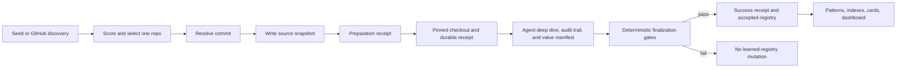

# GitHub Pattern Knowledge

[](https://github.com/libenxier-beep/github-pattern-knowledge/actions/workflows/ci.yml)
[](LICENSE)
[](package.json)

A local, file-backed system for turning commit-pinned GitHub evidence into reusable engineering knowledge.

The pipeline has two deliberately separate phases:

1. `daily` selects one repository and records a bounded source snapshot. It cannot publish patterns, cards, indexes, routed notes, or learned-registry state.
2. `finalize` verifies a real pinned checkout, source files, artifact provenance, transfer contract, report, ownership, and source commit before it can publish success metadata and mark the repository accepted.

This separation keeps discovery cheap and reversible while making durable knowledge expensive to claim.

## Core Invariants

- A title, filename, heuristic template, or self-reported score/checkout flag is never evidence of a reusable loop.
- Daily preparation writes only source evidence and a failed/preparation receipt. The `failed` status is retained for compatibility until a deep finalization succeeds.
- Finalization requires an existing source run plus a durable checkout receipt whose repository, Git origin, Git HEAD, fixture flag, and commit match the manifest.
- Accepted units need production evidence, corroboration, unique ids and artifacts, correct Work Context ownership, bounded scores, and complete cross-domain transfer bridges.
- Accepted artifact frontmatter must bind the same repository and commit and list evidence files that exist in the pinned checkout.
- Locators are canonical, authority-scoped relative paths; aliases, traversal, arbitrary absolute paths, and wrong-root fallbacks fail closed.
- Finalization is serialized with preparation, rejects conflicting replay for one run id, and rolls back receipt/run mutations when the learned-registry commit fails.
- Only `accepted` registry records suppress future ingestion. `legacy_unreviewed` and `quarantined` records remain eligible.
- Concurrent daily runs and concurrent registry writers are guarded by owner-aware cross-process locks. Registry publication uses atomic replacement.
- Historical run locators are part of the harness contract; archive or quarantine moves must retain a resolvable migration receipt.

## Flow



## Quick Start

Requirements: Node.js 22.12+ and npm 10+.

```bash
git clone https://github.com/libenxier-beep/github-pattern-knowledge.git
cd github-pattern-knowledge
npm install
npm run daily -- --fixture
npm test
npm run harness
```

The fixture command is a preparation smoke test. It intentionally produces no accepted pattern or learned repository.

For GitHub discovery, optionally provide a token and run:

```bash
export GITHUB_TOKEN=your_github_token_here
npm run daily
```

Keep secrets in the shell environment or `.env.local`. Do not commit tokens, local knowledge, `node_modules`, or `dist`.

## Commands

```bash
npm run daily                 # select and snapshot one candidate
npm run --silent automation-preflight  # emit one machine-readable JSON readiness result
npm run daily -- --fixture    # deterministic preparation smoke test
npm run daily -- --skip-seeds # bypass pending seeds for discovery
npm run seed -- --list        # list pending seed repositories
npm run seed -- --limit 3     # prepare up to three pending seeds
npm run finalize -- --manifest /absolute/path/value_manifest.json
npm run index                 # regenerate active retrieval indexes
npm run evidence              # maintain legacy evidence tables
npm run harness               # validate active notes, cards, and run locators
npm run dev                   # local dashboard
npm test
npm run typecheck
npm run build
```

## Phase 1: Preparation

`npm run daily`:

1. Acquires the configured knowledge-root daily lock, so separate worktrees targeting the same knowledge base cannot overlap.
2. Uses pending accepted-status-aware seeds first, then ordinary GitHub discovery.
3. Scores candidates and selects one repository.
4. Resolves a concrete commit and captures bounded repository evidence.
5. Writes `sources/<run_id>/repo_snapshot.json` and a receipt under `runs/failed/`.

Preparation does not invoke a pattern extractor. It does not modify active patterns, other Work Contexts, cards, indexes, or the learned registry.

## Phase 2: Deep Finalization

A capable agent or human performs the source-complete analysis and prepares:

- a plain-language report
- at least four distinct audit files
- accepted and rejected unit records
- a durable checkout receipt for the real Git repository at the pinned commit
- a schema `1.5` `value_manifest.json` bound to the preparation run, repository, commit, checkout receipt, and required independent `reader_review_file`; it must identify every important, non-obvious core functional paradigm, explain its problem, design choice, source-observed mechanism, counterfactual importance, benefits, clever move, tradeoffs, evidence, and canonical accepted loop, and include at least one justified structural transfer (older `1.0` through `1.4` manifests remain historical evidence, not replayable publication input)
- pattern or routed artifacts whose `source_repos` frontmatter names that repository, commit, and evidence files

Then run:

```bash
npm run finalize -- --manifest /absolute/path/value_manifest.json
```

The deterministic gate rejects:

- missing, fixture, wrong-run, wrong-repository, or wrong-commit source/checkout receipts
- unverifiable Git origin/HEAD, a dirty checkout, evidence absent from the pinned Git tree or whose filtered working bytes differ from its commit blob, fewer than two distinct evidence files, or artifact evidence declarations that do not exactly match that set
- unknown unit kinds, or duplicate/non-canonical unit, artifact, audit, report, or receipt locators
- artifact ownership that does not match its Work Context path
- no accepted canonical loop or no complete transfer bridge
- a missing or malformed primary-value thesis; no important, non-obvious core functional paradigm; a paradigm without counterfactual importance, causal mechanism, benefits, clever move, tradeoffs, pinned evidence, or canonical alignment; or a missing/failed/malformed independent reader review receipt
- a report whose presentation leaks source identifiers, lacks a separated evidence appendix, or is substantively empty; semantic quality is enforced through the paradigm manifest, pinned evidence, canonical loops, and independent-reader receipt rather than prescribed headings
- missing production/corroborating evidence, duplicate references, or evidence files absent from the checkout
- accepted pattern artifacts that fail the taxonomy, frontmatter, required-section, evidence-table, or filename/id harness
- out-of-range scores, low dimensions, or total score below 85
- missing artifacts, malformed historical locator shapes, or a report that leaks source identifiers into its main narrative

The full transfer bridge captures the commodity baseline, production pressure, precise craft move, obvious alternative failure, one or more justified transfer destinations, invariants, non-transferable details, break conditions, a recall cue, a bounded adaptation task, and a deterministic acceptance check.

See `docs/daily-workflow.md` for the canonical end-to-end runbook and `docs/human-report-quality-standard.md` for the positive report contract and paired false-success scenarios. Required headings and length floors are mechanical guards; the actual standard is that a reader can retell one concrete end-to-end case, explain the primary mechanism and evidence boundary, distinguish adjacent approaches, and state their composition sequence. Explanation sufficiency takes priority over a target character count.

## Knowledge Location

For the local Codex system project, the default knowledge root is:

```text
$HOME/.codex/memories/work_contexts/github_engineering_patterns/
```

The default is bound by the tracked `repository_id`, not by the checkout directory name, so isolated automation worktrees resolve to the same authority. Unidentified checkouts must bind both roots explicitly; deployment preflight fails before discovery when that binding or either registry is missing or inconsistent.

Use isolated roots for tests or migrations:

```bash
export KNOWLEDGE_ROOT=/path/to/work_contexts/github_engineering_patterns
export WORK_CONTEXTS_ROOT=/path/to/work_contexts # optional explicit override
```

If only `KNOWLEDGE_ROOT` is set, routed Work Context ownership derives from its parent directory so one run cannot split writes across unrelated roots.

```text
github_engineering_patterns/
  patterns/           active accepted complete-loop notes
  indexes/            generated retrieval projections
  cards/              human-facing reports; not default Agent retrieval
  registry/           seeds, status-aware provenance, migration receipts
  rejected/           rejected evidence and recoverable quality quarantine
  sources/            commit-pinned snapshots and audit trails
  schemas/            taxonomy and retrieval policy
  runs/               preparation, success, and finalization receipts
```

`patterns/` is the active knowledge authority. `indexes/` is generated. `cards/` is a human projection. `sources/`, `runs/`, and `rejected/` preserve evidence and recovery history.

## Validation

Run all gates before claiming the knowledge base is ready:

```bash
npm test
npm run typecheck
npm run build
npm run harness
```

The harness validates active pattern/card structure, accepted-registry ownership, card/source eligibility, related-pattern resolution, local-path portability, and authority-scoped locators in historical run JSON (including nested batch results). It refuses absolute, traversal, symlink-escape, and same-name/wrong-root matches. Work Context repository validation and lifecycle audits remain separate because they govern the wider memory tree.

## Dashboard

```bash
npm run dev
```

The local dashboard shows active cards and patterns, generated indexes, logical run state, failures, and repository status. Run records with the same `run_id` are merged with `success > failed > receipt/unknown` precedence so an incomplete finalization receipt cannot hide a failed run.

## Project Boundaries

This repository intentionally avoids cloud deployment assumptions, vector databases, graph databases, unbounded browsing, and automatic publication of private knowledge. Auditability and recoverability take priority over ingestion volume.

See `CONTRIBUTING.md`, `SECURITY.md`, and `CODE_OF_CONDUCT.md` for project participation and reporting guidance.

## License

MIT. See `LICENSE`.
