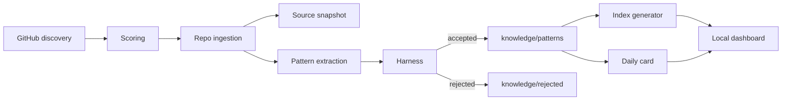

# Architecture

## Boundary Map

- `src/discovery/`: GitHub-only repository discovery.
- `src/github/`: REST API wrapper with optional `GITHUB_TOKEN`.
- `src/ingestion/`: bounded repo context collection and source snapshot writing.
- `src/scoring/`: weighted candidate scoring.
- `src/extraction/`: extractor interface plus deterministic heuristic extractor.
- `src/knowledge/`: Markdown/frontmatter utilities, scaffolding, pattern writes.
- `src/harness/`: schema, taxonomy, content quality, traceability checks.
- `src/indexes/`: generated JSON retrieval indexes.
- `src/cards/`: daily human card generation.
- `src/scheduler/`: daily orchestration.
- `src/web/`: Vite local dashboard and local file API.

## Data Flow

## MVP Decision

The knowledge base is file-backed and Markdown-first. JSON indexes are generated artifacts. The first version avoids SQLite, vector search, graph storage, cloud deployment, and human approval gates so that the local loop remains auditable and easy for Codex to modify.
