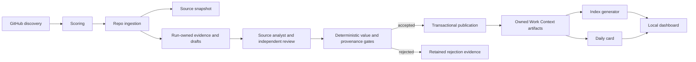

# Architecture

## Boundary Map

- `src/discovery/`: GitHub-only repository discovery.
- `src/github/`: REST API wrapper with an authenticated credential adapter. It prefers an explicit token, then the process environment, then the existing `gh` Keychain login; secrets are never copied into worktrees or diagnostics.
- `src/ingestion/`: bounded repo context collection and source snapshot writing.
- `src/scoring/`: weighted candidate scoring.
- `src/extraction/`: bounded evidence-pack, LLM proposal/review support, and a separate deterministic heuristic extractor used only by explicit fixtures or development tests.
- `src/knowledge/`: Markdown/frontmatter utilities, scaffolding, pattern writes.
- `src/harness/`: schema, taxonomy, content quality, traceability checks.
- `src/indexes/`: generated JSON retrieval indexes.
- `src/cards/`: daily human card generation.
- `src/scheduler/`: preparation, whole-run lease, draft publication transaction, crash recovery, and finalization.
- `src/web/`: Vite local dashboard and local file API.

## Data Flow

## LLM Boundary

LLM usage is intentionally narrow. It may propose source synthesis, candidates, transfers, and a reader-facing report. Independent review is explicit. Discovery, scoring, commit-pinned ingestion, source snapshots, lease ownership, provenance checks, value gates, transactional publication, registry mutation, indexing, and delivery receipts remain deterministic or caller-owned.

`createExtractor()` chooses the extraction path:

- `EXTRACTOR_MODE=heuristic`: an explicit development/fixture path; it is not accepted as a scheduled learning result.
- `EXTRACTOR_MODE=llm`: require `OPENAI_API_KEY`; model or reviewer failure is returned as a failure.
- `EXTRACTOR_MODE=auto`: legacy development selection only. The scheduled deep-dive workflow does not silently switch to heuristic output.

`LLMExtractor` rejects any configured heuristic fallback. The scheduled workflow must retain the failure evidence and stop; deterministic gates may reject a proposal but may not invent a replacement proposal.

The LLM receives a bounded evidence pack, not unbounded repository access. The host normalizes repo, URL, commit, and reference files back to the commit-pinned source snapshot before harness validation.

## MVP Decision

The knowledge base is file-backed and Markdown-first. JSON indexes are generated artifacts. The first version avoids SQLite, vector search, graph storage, cloud deployment, and human approval gates so that the local loop remains auditable and easy for Codex to modify.
