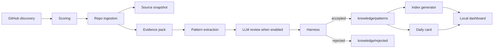

# Architecture

## Boundary Map

- `src/discovery/`: GitHub-only repository discovery.
- `src/github/`: REST API wrapper with optional `GITHUB_TOKEN`.
- `src/ingestion/`: bounded repo context collection and source snapshot writing.
- `src/scoring/`: weighted candidate scoring.
- `src/extraction/`: extractor interface, factory, deterministic heuristic fallback, LLM extractor, reviewer prompts, and evidence-pack construction.
- `src/knowledge/`: Markdown/frontmatter utilities, scaffolding, pattern writes.
- `src/harness/`: schema, taxonomy, content quality, traceability checks.
- `src/indexes/`: generated JSON retrieval indexes.
- `src/cards/`: daily human card generation.
- `src/scheduler/`: daily orchestration.
- `src/web/`: Vite local dashboard and local file API.

## Data Flow

## LLM Boundary

LLM usage is intentionally narrow. It only participates in `Pattern Extraction` and `Pattern Review`; discovery, scoring, commit-pinned ingestion, source snapshot writing, harness validation, indexing, learned-repo archive writes, and dashboard reads remain deterministic.

`createExtractor()` chooses the extraction path:

- `EXTRACTOR_MODE=heuristic`: always use deterministic heuristic extraction.
- `EXTRACTOR_MODE=llm`: require `OPENAI_API_KEY` and use LLM extraction with heuristic fallback on extraction failure.
- `EXTRACTOR_MODE=auto`: use LLM only when `OPENAI_API_KEY` is present.

The LLM receives a bounded evidence pack, not unbounded repository access. The host normalizes repo, URL, commit, and reference files back to the commit-pinned source snapshot before harness validation.

## MVP Decision

The knowledge base is file-backed and Markdown-first. JSON indexes are generated artifacts. The first version avoids SQLite, vector search, graph storage, cloud deployment, and human approval gates so that the local loop remains auditable and easy for Codex to modify.
